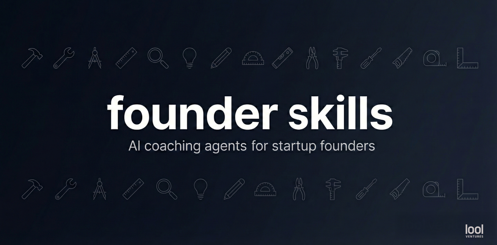

<p align="center">
  
</p>

[](https://claude.com/blog/cowork-plugins)
[](https://code.claude.com/docs/en/plugins)
[](https://github.com/lool-ventures/founder-skills/actions/workflows/ci.yml)
[](LICENSE)
[](https://www.python.org/downloads/)
[](https://deepwiki.com/lool-ventures/founder-skills)
[](https://github.com/yaniv-golan/skill-creator-plus)
[](https://founderskills.lool.vc/static/install-claude-desktop.html)

Skills for startup founders by [lool ventures](https://lool.vc).

A [Claude Cowork](https://claude.com/blog/cowork-plugins) plugin that gives founders six AI-powered coaching skills: market sizing, pitch deck review, financial model review, IC simulation, competitive positioning, and cap-table modeling. Each skill follows a structured, script-backed workflow to produce analysis that holds up under investor scrutiny.

## Contents

- [Skills](#skills)
  - [Market Sizing](#market-sizing)
  - [Deck Review](#deck-review)
  - [IC Simulation](#ic-simulation)
  - [Financial Model Review](#financial-model-review)
  - [Competitive Positioning](#competitive-positioning)
  - [Cap-Table](#cap-table)
- [Getting Started](#getting-started)
  - [Claude Cowork](#claude-cowork)
  - [Claude Code](#claude-code)
  - [What to expect on your first run](#what-to-expect-on-your-first-run)
  - [Other platforms](#other-platforms-roadmap)
- [Development](#development)
- [Troubleshooting](#troubleshooting)
- [Privacy](#privacy)
- [Contributing](#contributing)
- [Contact](#contact)
- [License](#license)

## Skills

<picture>
  <source media="(prefers-color-scheme: dark)" srcset="assets/market_sizing.png">
  <source media="(prefers-color-scheme: light)" srcset="assets/market_sizing-light.png">
  
</picture>

<a id="market-sizing-agent"></a>

### Market Sizing

Builds credible TAM/SAM/SOM analysis — the kind that earns investor trust rather than raising eyebrows.

**What it does:**
- Calculates TAM/SAM/SOM using top-down, bottom-up, or both approaches
- Validates market claims against external sources (analyst reports, government data, industry stats)
- Stress-tests assumptions with sensitivity analysis and confidence-based range widening
- Runs a 22-item self-check against common market sizing pitfalls
- Cross-checks every figure across the analysis before writing the report, so the numbers agree with each other

**What to provide:** A pitch deck, financial model, market data, or just describe the business (product, target customer, geography, pricing). The skill will research external sources to validate and build the estimate.

**What you get back:** A structured report with TAM/SAM/SOM figures (top-down and/or bottom-up), sensitivity ranges showing best/worst case, a scored self-check against common pitfalls, and coaching commentary on what will hold up in diligence.

**Example prompts:**
- "Use the market-sizing skill — here's the deck for Acme Corp, can you validate their market sizing?"
- "Use the market-sizing skill on a fintech startup in the payments space targeting SMBs in Europe."
- "Use the market-sizing skill — and show me what happens if the customer count is 30% lower."

> Technical workflow spec (for the agent runtime — not required reading): [`founder-skills/skills/market-sizing/SKILL.md`](founder-skills/skills/market-sizing/SKILL.md)

<picture>
  <source media="(prefers-color-scheme: dark)" srcset="assets/deck_review.png">
  <source media="(prefers-color-scheme: light)" srcset="assets/deck_review-light.png">
  
</picture>

<a id="deck-review-agent"></a>

### Deck Review

Reviews pitch decks against current investor best practices, calibrated by stage (pre-seed, seed, Series A).

**What it does:**
- Scores 35 criteria across 7 categories (pass/fail/warn/not_applicable)
- Detects fundraising stage and applies stage-specific expectations
- Reviews each slide from the investor's perspective with specific, actionable feedback
- Grounds every recommendation in a named best-practice principle
- Assembles a scored report with overall deck readiness assessment

**What to provide:** A pitch deck in any format — PDF, PowerPoint, markdown, or text descriptions of your slides.

**What you get back:** A slide-by-slide review from the investor's perspective, a scored checklist (35 criteria across 7 categories), an overall readiness rating (strong/solid/needs work/major revision), and coaching on the highest-leverage changes to make before sending.

**Example prompts:**
- "Use the deck-review skill on our seed deck."
- "Use the deck-review skill — is this ready to send to investors? We're raising a pre-seed."
- "Use the deck-review skill on these slides: Slide 1 is our company intro with the tagline 'AI-powered compliance for fintechs'..."

> Technical workflow spec (for the agent runtime — not required reading): [`founder-skills/skills/deck-review/SKILL.md`](founder-skills/skills/deck-review/SKILL.md)

<picture>
  <source media="(prefers-color-scheme: dark)" srcset="assets/ic_sim.png">
  <source media="(prefers-color-scheme: light)" srcset="assets/ic_sim-light.png">
  
</picture>

<a id="ic-simulation-agent"></a>

### IC Simulation

Simulates a realistic VC Investment Committee discussion with three partner archetypes debating a startup's merits, concerns, and deal terms -- scored across 28 dimensions.

**What it does:**
- Simulates three distinct partner perspectives: The Visionary (markets/timing), The Operator (execution/GTM), The Analyst (unit economics/financials)
- Forms each partner's view independently, so they genuinely disagree rather than echoing one another
- Scores 28 dimensions across 7 categories (team, market, product, business model, financials, risk, fund fit)
- Checks portfolio conflicts against the fund's existing investments
- Can simulate a named fund, researching its thesis and portfolio first
- Imports prior market-sizing and deck-review artifacts for grounded analysis

**What to provide:** A pitch deck, financial model, data room contents, or a verbal description of the business. Optionally, name a specific fund to simulate (e.g. "How would Sequoia evaluate us?"). Works best after running market sizing and/or deck review first — those artifacts are imported automatically.

**What you get back:** A simulated IC debate with three distinct partner voices, a conviction score across 28 dimensions, a consensus verdict (invest / more diligence / decline / decline — hard pass), portfolio conflict analysis, and coaching on exactly what to prepare before a real IC meeting.

**Example prompts:**
- "Use the ic-sim skill to simulate an IC discussion for our startup."
- "Use the ic-sim skill — how would partners at a fund like this discuss our company?"
- "I just did market sizing and a deck review — now use the ic-sim skill."

> Technical workflow spec (for the agent runtime — not required reading): [`founder-skills/skills/ic-sim/SKILL.md`](founder-skills/skills/ic-sim/SKILL.md)

<picture>
  <source media="(prefers-color-scheme: dark)" srcset="assets/financial_model_review.png">
  <source media="(prefers-color-scheme: light)" srcset="assets/financial_model_review-light.png">
  
</picture>

<a id="financial-model-review-agent"></a>

### Financial Model Review

Reviews startup financial models for investor readiness — validating structure, unit economics, runway, and metrics against stage-appropriate standards.

**What it does:**
- Scores 46 criteria across 7 categories, skipping the ones that don't apply to your stage, geography or sector
- Computes and benchmarks 11 unit economics metrics against stage-appropriate targets
- Stress-tests runway under base, slow-growth, and crisis scenarios with decision-point analysis
- Supports Excel (.xlsx), CSV, a link to a Google Sheet, pitch decks, and conversational input
- Cross-checks every figure across the analysis before writing the report, so the numbers agree with each other

**What to provide:** A financial model in any format — Excel spreadsheet, CSV, a link to a Google Sheet, financial slides from a deck, or just describe the numbers in conversation. The skill adapts its analysis depth to the format provided.

**What you get back:** A scored checklist (46 criteria across 7 categories), benchmarked unit economics with ratings, multi-scenario runway projections with cash-out dates and decision points, an overall readiness rating (strong/solid/needs work/major revision), and coaching on the highest-leverage improvements.

**Example prompts:**
- "Use the financial-model-review skill on my model" (with an Excel file attached)
- "Use the financial-model-review skill on our projections from the deck — validate the unit economics."
- "Use the financial-model-review skill: we're burning $80K/mo with $1.2M in the bank, growing 15% MoM."

> Technical workflow spec (for the agent runtime — not required reading): [`founder-skills/skills/financial-model-review/SKILL.md`](founder-skills/skills/financial-model-review/SKILL.md)

<picture>
  <source media="(prefers-color-scheme: dark)" srcset="assets/competitive_positioning.png">
  <source media="(prefers-color-scheme: light)" srcset="assets/competitive_positioning-light.png">
  
</picture>

<a id="competitive-positioning-agent"></a>

### Competitive Positioning

Maps a startup's competitive landscape, scores differentiation and moat strength, and stress-tests positioning claims — producing investor-ready competitive analysis.

**What it does:**
- Identifies 5-7 competitors across direct, adjacent, emerging, and do-nothing categories
- Places you and your rivals on two axes, and calls out an axis chosen to flatter you rather than to inform
- Assesses 6 canonical moat dimensions per company with trajectory tracking
- Stress-tests differentiation claims against competitive evidence
- Runs a 25-item quality checklist, scoped to how much source material you gave it
- Optionally researches the web to find competitors you didn't list

**What to provide:** A pitch deck, product description, or conversation about the business. The skill will identify competitors, select meaningful positioning axes, and build the analysis. Works best after running deck review — competition slide claims are cross-validated automatically.

**What you get back:** A scored competitive landscape with positioning maps, moat radar charts, differentiation scores with stress-test results, a quality checklist, and an interactive explorer for navigating the competitive set.

**Example prompts:**
- "Use the competitive-positioning skill on our landscape."
- "Use the competitive-positioning skill — who are our main competitors and how do we differentiate?"
- "I just did a deck review — now use the competitive-positioning skill."

> Technical workflow spec (for the agent runtime — not required reading): [`founder-skills/skills/competitive-positioning/SKILL.md`](founder-skills/skills/competitive-positioning/SKILL.md)

<picture>
  <source media="(prefers-color-scheme: dark)" srcset="assets/cap_table.png">
  <source media="(prefers-color-scheme: light)" srcset="assets/cap_table-light.png">
  
</picture>

<a id="cap-table-agent"></a>

### Cap-Table

Models what a founder's term sheets, SAFEs, and convertible notes actually do to their ownership — before they sign — with every calculation traceable to a cited source, plus a counsel-handoff packet.

**What it does:**
- Extracts structured terms from SAFEs, convertible notes, term sheets, articles of association, and Carta XLSX exports
- Runs SAFE and convertible-note conversion math across all forms (post-money cap, MFN, cap-and-discount, and legacy variants)
- Projects priced-round dilution with broad-based weighted-average (BBWA), narrow-based, and full-ratchet anti-dilution, plus option-pool top-ups and warrants
- Models Israeli ↔ Delaware flips (1:1 share-for-share), MFN chains, pay-to-play, and dual-class voting-power structures
- Produces a counsel-handoff packet citing primary sources (NVCA model docs, YC SAFE primer, Cooley GO, Israeli Companies Law)

**What to provide:** A signed or draft SAFE, convertible note, term sheet, option plan, warrant, articles of association, or Carta XLSX — or a structured description of holders and outstanding instruments.

**What you get back:** From a full review — source-cited conversion and dilution math, a pre/post-financing cap-table snapshot, anti-dilution and option-pool scenarios, a counsel-handoff packet, an interactive explorer (animated scenario comparison, plus a drag-to-model pre-money slider on priced rounds, where every value shown is really computed rather than interpolated), and a founder-readable report explaining exactly how each instrument moves your ownership. Lighter paths return less on purpose: a single quick question gets a cited answer with no artifacts, and one instrument with no surrounding cap table gets an instrument-terms report rather than a full snapshot.

> These are modeling tools, not legal, tax or investment advice. The counsel-handoff packet exists precisely because these numbers need a lawyer's eyes before you sign anything.

**Example prompts:**
- "Use the cap-table skill on our YC SAFE — how much do we dilute at the priced round?"
- "Use the cap-table skill: we have three SAFEs and a convertible note — what does the cap table look like after a $4M seed on a $16M pre?"
- "Use the cap-table skill — we're flipping from an Israeli Ltd. to a Delaware C-corp."

> Technical workflow spec (for the agent runtime — not required reading): [`founder-skills/skills/cap-table/SKILL.md`](founder-skills/skills/cap-table/SKILL.md)

## Getting Started

Claude Cowork is the primary target — most founders run these skills there. Claude Code works too.

### Claude Cowork

[](https://founderskills.lool.vc/static/install-claude-desktop.html)

*— or install manually —*

1. Click **Customize** in the sidebar.
2. Choose **Plugins**. The **Directory** dialog opens, with **Anthropic**, **Partners** and
   **Personal** tabs.
3. Click the **+** at the right of that tab row → **Add marketplace** → **Add from a repository**.
4. In the **URL** field, pick `lool-ventures/founder-skills`. It's a repository picker, not a plain
   text box — search it, or paste a `owner/repo` or git URL.
5. Click **Sync**. You'll see a trust warning first: plugins from marketplaces aren't controlled or
   verified by Anthropic. That's standard for every non-Anthropic marketplace, ours included.
6. You land back in the **Directory**, on a **Personal** tab for the new marketplace. On the
   **Founder skills** card, click **+** to install.
7. To confirm: **Customize** → **Plugins** → **Personal** now lists *Founder skills*.

> Step 6 is the one people miss. **Syncing the marketplace does not install the plugin** — you still
> have to click the `+` on the card. The two `+` buttons look alike and do different things: the one
> on the tab row adds a *marketplace*, the one on a card installs a *plugin*.

Cowork runs inside the Claude Desktop app, so if you're looking for a "Claude Desktop" section, this is it.
Nothing else to install — the Cowork sandbox already has everything the skills need.

### Claude Code

```
claude plugin marketplace add lool-ventures/founder-skills
claude plugin install founder-skills@lool-founder-skills
```

No additional configuration required. Each skill activates when you ask for that analysis **and give it something to work with** — a deck, a model, a described business. A general question about fundraising won't trigger a full analysis, by design: say "review this deck", "size this market", or attach the file.

Unlike Cowork, Claude Code runs the skills' scripts on **your** machine, so you need **Python 3.10+** available. Reading Excel models needs `openpyxl` and reading PDFs needs `pdfplumber`; install them into whatever Python `python3` resolves to if you hit a missing-module error on your first file.

### What to expect on your first run

**Name the skill you want** — that is why every example above says so. Either works:

- `/financial-model-review` (and the other five as slash commands), or
- plain prose: *"Use the financial-model-review skill on our model."*

If you only describe what you need, the assistant sometimes answers from its own knowledge instead. On a
couple of pasted figures that is not unreasonable — the deeper scoring needs more of your model anyway —
but you lose the source-cited benchmarks and the scored rubric, and it may not mention that it chose not
to run. Naming the skill removes the ambiguity.

Ask for an analysis and the skill works through it in steps, narrating as it goes. **Expect a few minutes per analysis, not seconds** — each one researches, computes and cross-checks before it writes anything, and the longer skills do more work than a single answer.

You get a written report plus, for most skills, an HTML version and an interactive explorer.

In **Claude Code** they land in `artifacts/<skill>-<company>/`, in whatever directory you started from, and they stay there.

In **Cowork** the skill writes them into the task's workspace under `artifacts/<skill>-<company>/`, and usually attaches the main ones to the conversation as well. **Download anything you want to keep.** Where that workspace lives — and whether it outlives the task — depends on whether the task is running in the cloud or on your computer. Cloud is the default for a new task, and a cloud workspace is temporary: when the task ends, whatever you did not download or save elsewhere is gone. If you want the full set on disk, connect a folder to the task and ask for the files to be written there.

### Other agents (Agent Skills standard) — not supported for this plugin

`npx skills add` copies each skill's `SKILL.md`, `scripts/` and `references/` into `.agents/skills/<name>/` in your project — that directory is where you'd look to see what it copied. But that layout cannot run these skills, in **any** host — Claude Code, Cursor, Copilot, Windsurf or otherwise:

- every skill resolves its scripts through the plugin root, which that layout doesn't create;
- the shared helper scripts all six skills call live outside any single skill folder, so a per-skill copy can't contain them;
- the sub-agent definitions the skills dispatch to aren't skills and don't come along;
- neither does the `/founder-skills:feedback` command or the session-start hook.

A skill installed that way fails on its first step. This isn't a bug at either end: the standard assumes self-contained skills, and this is a plugin — six skills over a shared script library, a shared agent pool and a hook. Use the Cowork or Claude Code sections above.

### Other platforms (roadmap)

**Manus** [adopted the Agent Skills standard](https://manus.im/blog/manus-skills) in January 2026 and can read `SKILL.md` files and execute bundled scripts. Our Python scripts are already portable (pure CLI, JSON in/out), but the workflow instructions in our SKILL.md files are Claude-native (sub-agent orchestration, plugin hooks, path resolution). We plan to add Manus-compatible wrappers once the platform's skill discovery and marketplace layer stabilizes.

**ChatGPT Work / Codex** — OpenAI has [adopted the skills standard](https://simonwillison.net/2025/Dec/12/openai-skills/) originally introduced by Anthropic, and skills now work across [ChatGPT, Codex CLI, and the OpenAI API](https://developers.openai.com/codex/skills/). Hosted sub-agents — which these skills lean on heavily — are available there too, and the packaging layer maps closely onto ours.

**It may already work. We have not tested it, so we do not claim it does.** First-class support is on the roadmap. Two things we expect to need attention when we get there:

- **Sub-agent tool scoping.** Hosted sub-agents use the tools available to the parent chat, and there is no per-spawn allowlist. The sub-agents that do the analysis here deliberately run without shell access, so that they cannot write the report they are supposed to be checking. On that surface, the same restriction would be advisory rather than enforced.
- **Blocking questions.** Several skills stop and ask you something before continuing — your stage, which scenario to model. We have not established whether a skill can do that there.

If you try it, we would like to know how it went: [open an issue](https://github.com/lool-ventures/founder-skills/issues).

## Development

Requires Python 3.10+ and [uv](https://docs.astral.sh/uv/). Quick start:

```bash
git clone https://github.com/lool-ventures/founder-skills.git
cd founder-skills
uv sync --extra dev   # install dependencies + dev tools
uv run pytest          # run tests
```

Because these skills are mostly run inside Claude Cowork, whose runtime differs from the Claude Code CLI
in ways unit tests can't see, they are also regression-tested against a Cowork-runtime emulation on every
PR — static analysis of every skill body plus deterministic replay of recorded runs, both token-free.

See [CONTRIBUTING.md](CONTRIBUTING.md) for the full development workflow, including how to run those
checks locally.

## Troubleshooting

**Plugin not updating after a new release?** The plugin cache does not always refresh when a marketplace is updated — a [known platform issue](https://github.com/anthropics/claude-code/issues/17361), still open. The fix depends on which app you're in.

**In Claude Cowork:**

1. First try **Check for updates** on the marketplace (the `⋯` menu next to it). That's usually enough
   — it enables the **Update** button on the plugin, and the version on the plugin's detail panel
   should then match the release you expect.
2. If it's still stale: **Customize** → **Plugins**, find *Founder skills* on the **Personal** tab, and remove it. Then re-add the marketplace and re-install it (the `+` on the plugin card in the Directory).
3. Start a **new task** afterwards. A task that's already running has the old skill files loaded and won't pick up the new ones.

**In Claude Code (the CLI):**

1. Enable auto-update: `/plugin` → Marketplaces → select `lool-founder-skills` → "Enable auto-update".
2. If that doesn't work, clear the cache and reinstall:
   ```
   rm -rf ~/.claude/plugins/cache/lool-founder-skills
   ```
   Then restart Claude Code and reinstall the plugin.

## Privacy

Your documents stay in your Claude session. **No data is collected, transmitted, or shared with lool ventures.**

Two things do reach the network, both worth knowing before you start on something unannounced:

- **Three skills search the web** as part of the work — market sizing validates your figures against external sources, IC simulation researches a named fund, competitive positioning researches competitors. Search queries derived from your materials therefore pass through Claude to a search provider. Cap-table, deck review and financial model review never touch the network.
- **The competitive-positioning explorer's optional 3D view** loads a charting library from a public CDN the first time you open that tab. Every other generated file is fully self-contained and works offline.

Feedback is opt-in and user-initiated: `/founder-skills:feedback` drafts a message and hands you a link to submit yourself — nothing is sent automatically.

## Contributing

We welcome contributions — new skills, improvements to existing ones, and bug fixes. See [CONTRIBUTING.md](CONTRIBUTING.md) to get started and [DESIGN.md](DESIGN.md) for the principles behind how skills are built.

## Contact

- **In-session feedback** — run `/founder-skills:feedback` while using the plugin (report a bug, suggest an idea, ask for help, or share a win)
- **Bug reports and feature requests** — [GitHub Issues](https://github.com/lool-ventures/founder-skills/issues)
- **Questions and discussion** — [GitHub Discussions](https://github.com/lool-ventures/founder-skills/discussions)
- **Private feedback** — [founder-skills@lool.vc](mailto:founder-skills@lool.vc)
- **Security vulnerabilities** — [Report privately](https://github.com/lool-ventures/founder-skills/security/advisories/new) (see [SECURITY.md](SECURITY.md))
- **About lool ventures** — [lool.vc](https://lool.vc)

## License

[Apache 2.0](LICENSE)

The bundled Sora typeface is licensed separately under the [SIL Open Font License 1.1](founder-skills/references/brand/fonts/OFL.txt).

---

Built with [Skill Creator Plus](https://github.com/yaniv-golan/skill-creator-plus).
